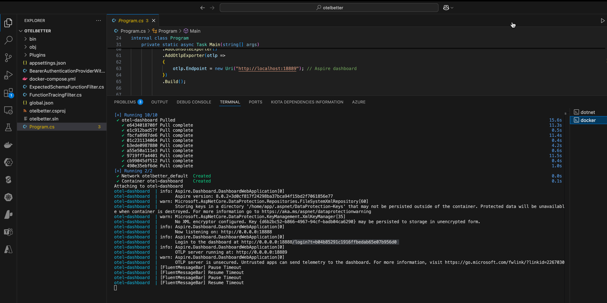
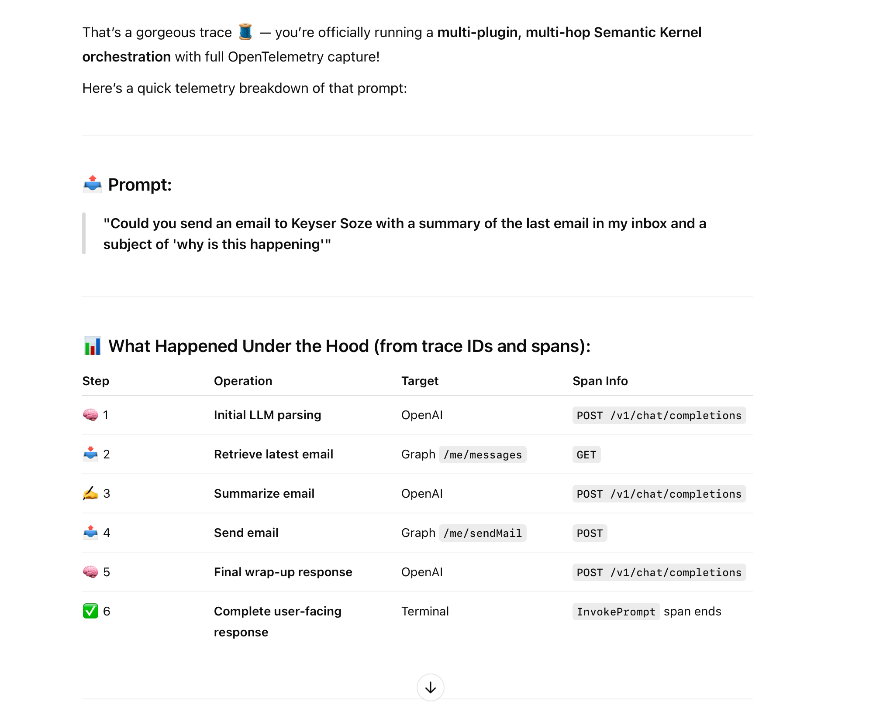
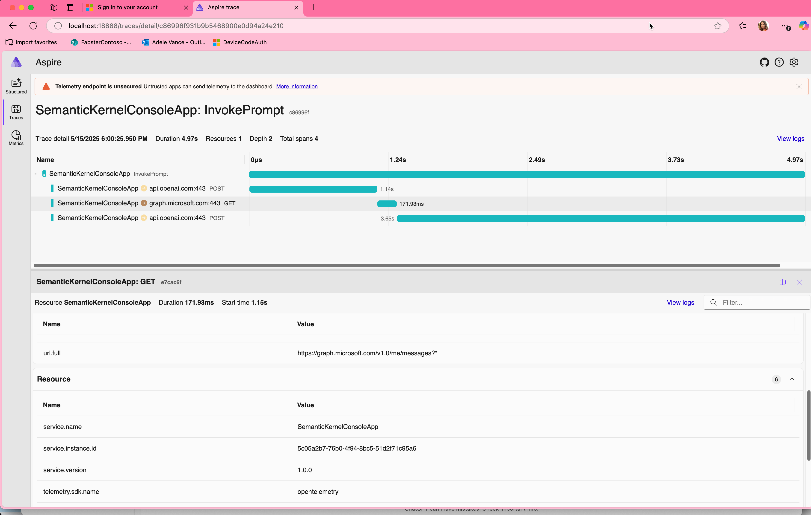
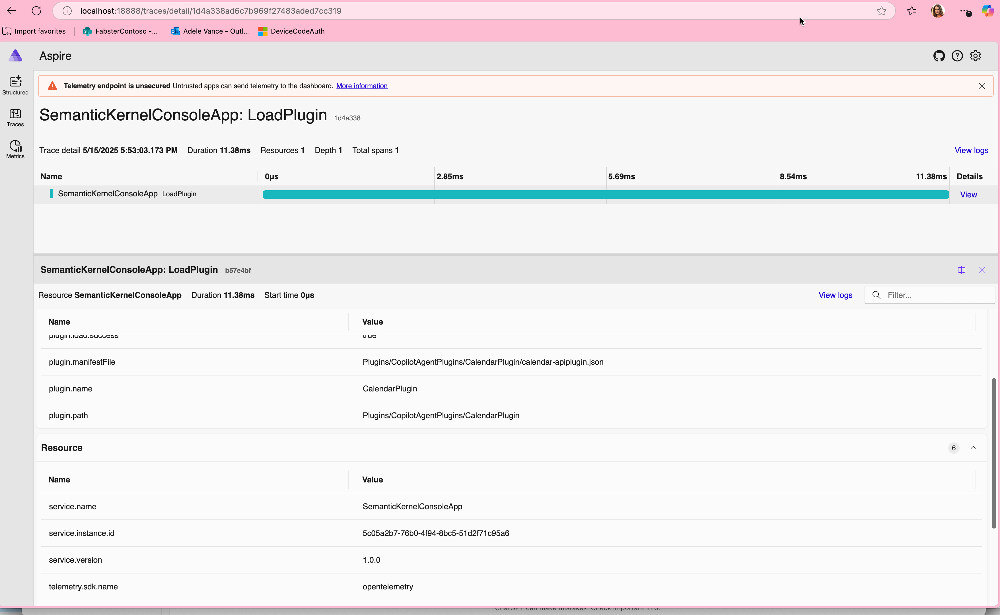
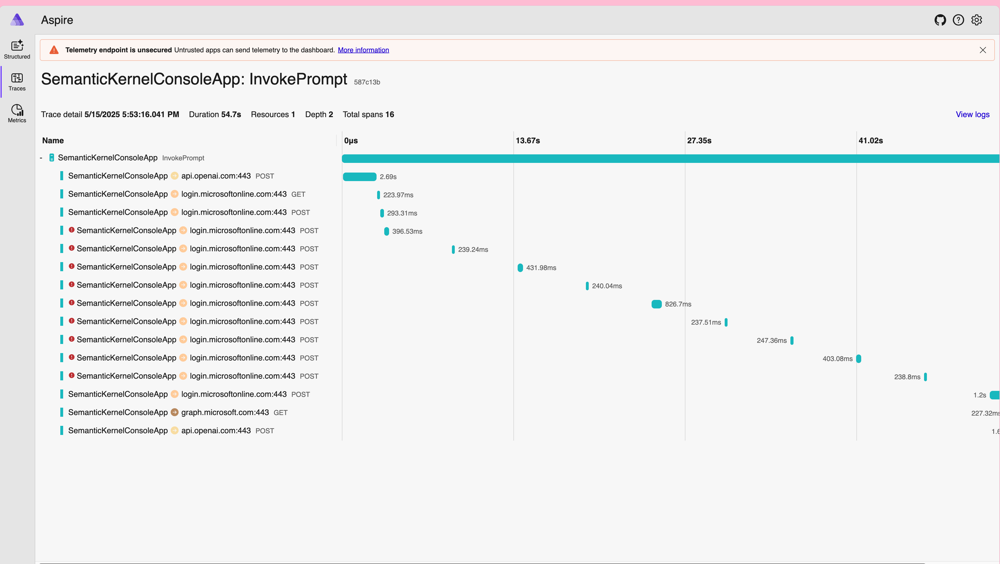
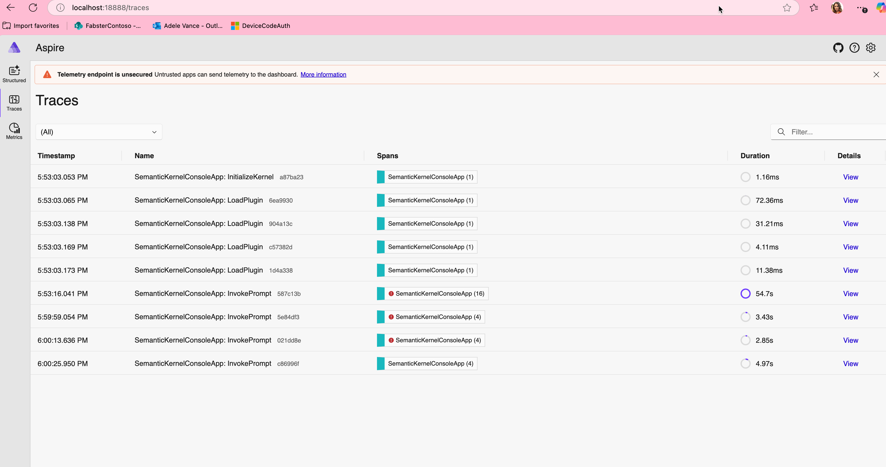

# 📊 Semantic Kernel + OpenTelemetry + Aspire Dashboard (PoC)

This project demonstrates a multi-plugin, multi-hop orchestration using [Semantic Kernel](https://github.com/microsoft/semantic-kernel) with full [OpenTelemetry](https://opentelemetry.io/) tracing—visualized through the .NET Aspire Dashboard via Docker.

&gt; 🔍 The goal was to observe how user prompts traverse across plugins, Graph API calls, and OpenAI completions with clear, traceable telemetry.

---

## 🛠️ Setup Overview

We used Docker Compose to launch the Aspire Dashboard:

```yaml
# docker-compose.yml
version: '3.4'
services:
  otel-dashboard:
    image: mcr.microsoft.com/dotnet/aspire-dashboard:8.0
    container_name: otel-dashboard
    ports:
      - "18888:18888"  # Web UI
      - "18889:18889"  # OTLP receiver
```

Once launched:

- The OTLP endpoint was configured at `http://localhost:18889`
- Dashboard available at [http://localhost:18888](http://localhost:18888)

📸 Screenshot: Aspire container started  


---

## 💬 Prompt Used

```
Could you send an email to Keyser Soze with a summary of the last email in my inbox and a subject of "why is this happening"
```

This prompt triggered a rich orchestration across services and plugins.

📸 Screenshot: Prompt and Response in Console  


---

## 🧠 What Happened Under the Hood?

| Step | Operation | Target | Span Info |  
|------|--------------------------|--------------------|------------------------------|  
| 🧠 1  | Initial LLM parsing      | OpenAI             | POST `/v1/chat/completions`  |  
| 📬 2  | Retrieve latest email    | Graph              | GET `/me/messages`           |  
| ✍️ 3  | Summarize email          | OpenAI             | POST `/v1/chat/completions`  |  
| 📤 4  | Send email               | Graph              | POST `/me/sendMail`          |  
| ✅ 5  | Final wrap-up response   | OpenAI             | POST `/v1/chat/completions`  |  
| 💡 6  | Complete user response   | Terminal           | `InvokePrompt` span ends     |

📸 Screenshot: Prompt breakdown  


---

## 📈 Traces Captured via Aspire

### ➕ Plugin Load Trace

Shows plugin load time, plugin name, manifest, and success status.

📸 Screenshot  


---

### 🧵 Multi-Hop Prompt Execution Trace

You can see each Graph and OpenAI call, their latency, and the parent-child span structure.

📸 Screenshot: Detailed Prompt Trace  


---

### ⚠️ Error Trace Example

Illustrates failed token calls to Microsoft Identity endpoints during auth negotiation.

📸 Screenshot: Error Highlighted Trace  


---

### 📊 All Captured Traces

Multiple `InvokePrompt` and `LoadPlugin` spans appear with full instrumentation.

📸 Screenshot: Traces All-Up View  


---

## ✅ Directory Structure

Your repo was structured like this:

```
OTELBETTER/
├── assets/                    # 📸 Screenshots used in this README
├── Plugins/                  # Copilot Agent Plugin manifests
├── Program.cs                # Core SK orchestration and telemetry config
├── docker-compose.yml        # Aspire dashboard setup
├── ReadMe.md                 # This documentation file
...
```

📸 Screenshot: File Layout  


---

## ✅ Deliverables Implemented

- [x] Console app with full OpenTelemetry instrumentation  
- [x] Aspire dashboard running via Docker  
- [x] Working multi-plugin prompt traces  
- [x] End-to-end Microsoft Graph + OpenAI LLM orchestration  
- [ ] CosmosDB export (next phase)  
- [ ] Blazor dashboard (future phase)  

---

## 📌 Next Steps

- [ ] Add OpenTelemetry exporter to CosmosDB  
- [ ] Build a Blazor dashboard to visualize plugin/tool usage  
- [ ] Wrap orchestration logic in Azure Functions (optional)

---

*Built with ❤️ by tracking every LLM whisper and Graph pulse.*
